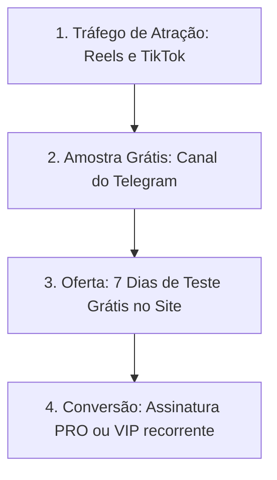

# Campanha de Marketing — A2SportTrackers 🚀

Plano estratégico focado em atração e conversão para o lançamento comercial do sistema de inteligência e valor esperado (+EV) no mercado de apostas de futebol.

---

## 🎨 Criativos Reais do Aplicativo (Para Redes Sociais)

Abaixo estão os templates visuais utilizando as telas reais da nossa aplicação, prontos para serem usados como criativos de anúncios:

````carousel

*Tela real de Alertas +EV contendo probabilidades de gols, sugestão de banca calculada e odds das casas comparadas.*
<!-- slide -->

*Lista dinâmica de jogos da rodada organizados por ligas no app mobile.*
<!-- slide -->

*Visão detalhada do cálculo de Poisson (1X2) e força ofensiva/defensiva de cada equipe.*
````

---

## 💡 Conceito Central da Marca
> **"Chega de apostar com o coração, comece a investir com matemática."**

A campanha posiciona o **A2SportTrackers** não como um simples grupo de palpites, mas como um **software financeiro analítico** de trading esportivo. Nosso público-alvo são apostadores cansados de perder dinheiro que desejam adotar uma abordagem profissional e fria baseada em dados estatísticos e no modelo de distribuição de Poisson.

---

## 📈 Funil de Vendas de Alta Conversão



### 1. Topo de Funil (Atração)
* **Canal**: Instagram Reels, YouTube Shorts e TikTok.
* **Conteúdo**: Vídeos curtos gravados de 30-45 segundos mostrando a tela do app (ex: *"Esta calculadora me mostrou que a odd real desse jogo de hoje está desregulada. A casa está pagando 2.10, mas a probabilidade matemática do robô indica que deveria ser 1.70. Encontrei valor esperado (+EV)!"*).

### 2. Meio de Funil (Nutrição)
* **Canal**: Canal Gratuito no Telegram (Bot de Sinais Grátis).
* **Conteúdo**: O robô envia de 1 a 2 sinais grátis por dia direto do painel (gerando valor real e provando a assertividade). Junto com o sinal, o canal compartilha dicas de gestão de banca explicadas de forma simples.

### 3. Fundo de Funil (Conversão)
* **Gatilho**: Período de Avaliação (*Free Trial*).
* **Processo**: O usuário clica no link do canal para ativar seu cadastro e ganhar **7 dias grátis**. A ativação é feita por cartão de crédito ou pix pelo checkout do Mercado Pago (com renovação recorrente ativa).

---

## ✍️ Modelos de Cópia (Copywriting) para Anúncios

### Anúncio 1: Focado na Razão (Público Mais Técnico)
> **Título**: O Segredo da Matemática Aplicada ao Futebol ⚽📐
>
> **Texto**:
> Você ainda aposta baseando-se apenas em intuição ou porque "acha" que o time vai ganhar? As casas de apostas adoram isso.
> 
> O **A2SportTrackers** analisa milhares de partidas reais em tempo real, calculando probabilidades reais utilizando o modelo de Poisson e o método de Kelly Fracionado para encontrar oportunidades onde as casas erraram a cotação (Odds +EV).
>
> Não dê mais dinheiro para a banca. Comece a tratar seu capital como um investimento de verdade.
>
> 🔗 Clique no link e garanta sua conta de testes gratuita hoje mesmo!

### Anúncio 2: Focado na Dor (Público Geral)
> **Título**: Cansado de Quebrar a Banca no Fim de Semana? 📉
>
> **Texto**:
> A maioria dos apostadores perde tudo no longo prazo porque não tem duas coisas: gestão financeira rígida e estatística real a seu favor.
>
> Com a nossa **Central de Palpites Automáticos** e **Calculadora de Banca**, você recebe recomendações exatas de qual porcentagem da sua banca deve investir em cada mercado específico (Resultado Final, Escanteios, Cartões, Gols) — minimizando as perdas e blindando seu capital no longo prazo.
>
> Use o robô de dados que as casas de apostas não querem que você use.
> 
> 🆓 Teste gratuitamente por 7 dias! Toque em 'Saiba Mais'.

---

## 📅 Cronograma de Lançamento em 3 Fases

### 🏁 Fase 1: Aquecimento (Dias 1 a 7)
* Publicação de vídeos explicativos sobre o que é "+EV" e "Distribuição de Poisson" no Instagram.
* Captação de leads para o canal gratuito de Telegram.

### 🚀 Fase 2: Lançamento Comercial (Dias 8 a 14)
* Abertura oficial das assinaturas pelo site com a campanha de "7 dias grátis".
* Disparo de depoimentos e estatísticas de lucros passados ( greens do robô ) no canal de Telegram gratuito para incentivar o upgrade para os planos PRO e VIP.

### 🔁 Fase 3: Retenção (A partir do Dia 15)
* Configuração do disparo automatizado dos resumos de rodada direto para o Telegram dos assinantes.
* Envio de cupons de desconto pontuais para usuários inativos do trial gratuito que ainda não assinaram.
